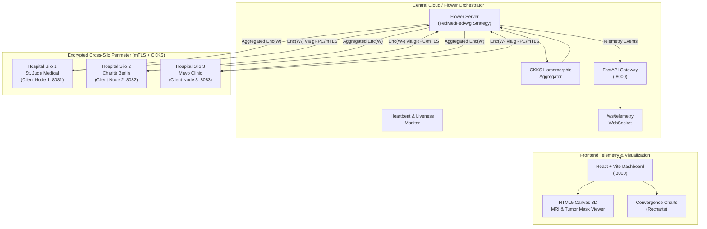

# FedMed System Architecture

FedMed is a privacy-preserving cross-silo federated learning engine designed for multi-institutional brain tumor segmentation on the BraTS (Brain Tumor Segmentation) multi-modal 3D MRI dataset.

## High-Level Topology

## Security & Trust Model

| Actor | Access Level | Stored Credentials / Keys | Security Constraints |
| :--- | :--- | :--- | :--- |
| **Flower Server** | Honest-but-curious | Public Evaluation Context (Galois + Relin Keys), Server TLS cert | Zero access to raw patient MRI data or plaintext model parameters. Performs homomorphic addition only. |
| **Hospital Nodes (1-3)** | Trusted Consortium | Consortium Secret Key (CKKS), Node mTLS cert & private key | Retain 100% of raw patient data on-premise; execute local DP gradient clipping and Gaussian noise before CKKS encryption. |
| **FastAPI Gateway** | Ephemeral Telemetry | Telemetry stream buffer, mock MRI cache | Emits anonymized aggregated round statistics only. |
| **React Dashboard** | Read-Only Client | None | Consumes telemetry feed and displays rendered slices. |

## Network Protocols & Ports

- **Flower Federated gRPC**: `:8080` (native gRPC with mutual TLS)
- **Node Auxiliary Channels**: `:8081` (Node 1), `:8082` (Node 2), `:8083` (Node 3)
- **FastAPI Telemetry & REST**: `:8000` (HTTP & WebSocket)
- **React Frontend Dashboard**: `:3000` (HTTP)

## Data Pipeline & Model Architecture

1. **Input**: Multi-modal 3D MRI volumes: 4 channels (T1, T1ce, T2, FLAIR).
2. **Backbone**: Compact 3D U-Net (~1.8M parameters) with MONAI building blocks.
3. **Normalization**: **InstanceNorm3d / GroupNorm ONLY**. BatchNorm is forbidden to guarantee compatibility with Differential Privacy (DP) sample isolation.
4. **Target Sub-regions**:
   - **WT**: Whole Tumor (Green)
   - **TC**: Tumor Core (Yellow)
   - **ET**: Enhancing Tumor (Red)
